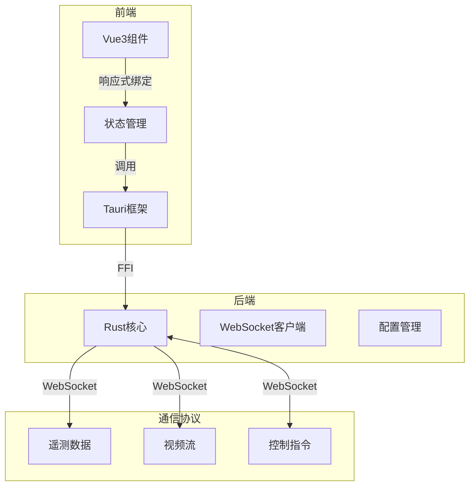
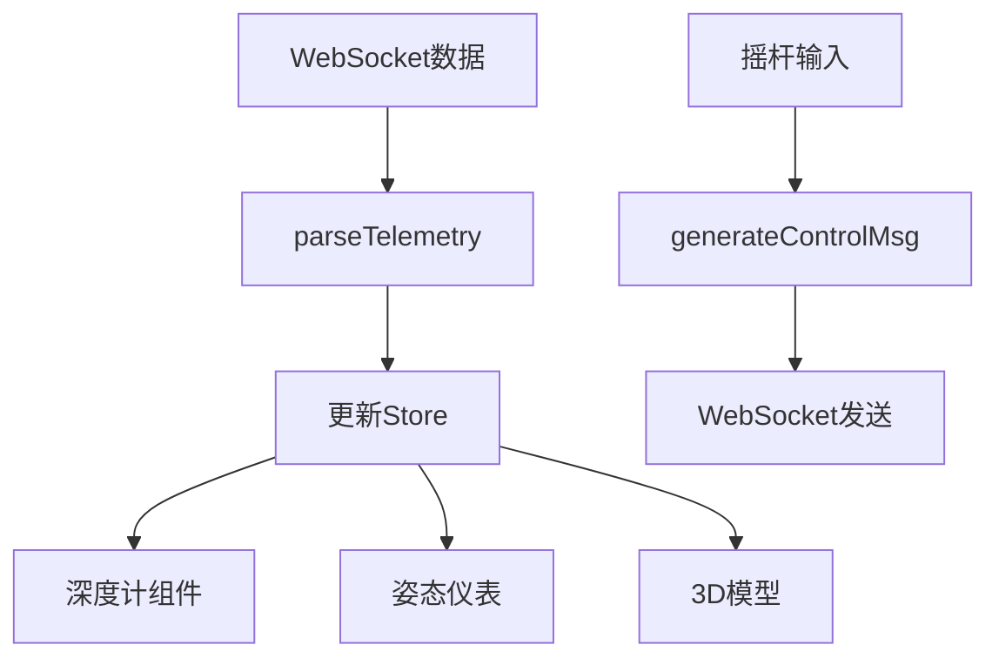
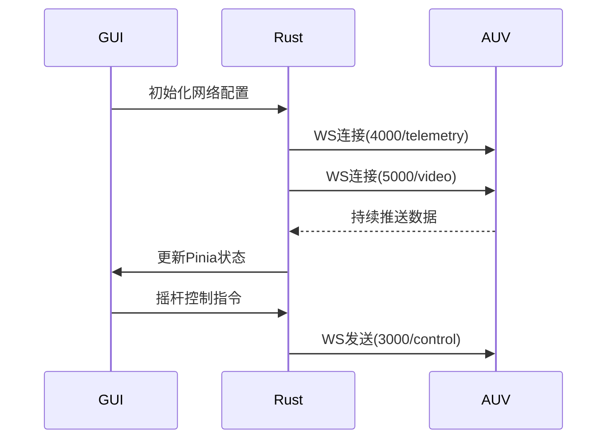
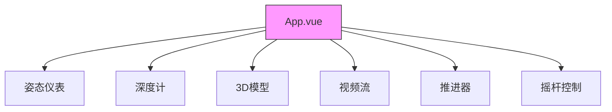
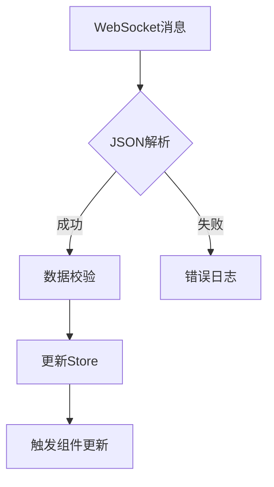
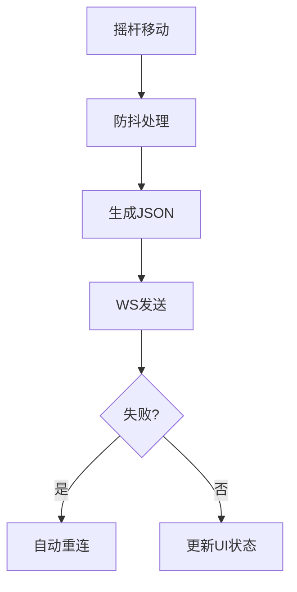

# 2.3 软件系统介绍
## 2.3.1 GUI系统整体设计

### 系统架构


### 关键功能模块
1. **实时数据显示**
   - 3D姿态模型
   - 视频流解码显示
   - 仪表盘可视化
2. **控制指令下发**
   - 双摇杆控制
   - 推进器状态反馈
3. **配置管理**
   - 网络参数配置
   - 主题设置

## 2.3.2 模块详细设计

### 1. 状态管理模块（Pinia）

#### 数据流程图


#### 关键数据结构
```typescript
// 使用 Pinia 保存系统状态
interface SubmarineState {
  roll: number       // 横滚角(rad)
  pitch: number      // 俯仰角(rad)
  yaw: number        // 偏航角(rad)
  depth: number      // 当前深度(m)
  thrusters: number[] // 推进器状态(-1~1)
  leftJoystick: {x: number, y: number}
  rightJoystick: {x: number, y: number}
  videoStream: string | null  // Base64视频帧
}
```

#### 核心方法说明
| 方法名 | 输入 | 输出 | 说明 |
|--------|------|------|------|
| `load_auv_config` | - | `AuvConfig` | 加载网络配置 |
| `send_joystick` | `left(x,y),right(x,y)` | - | 发送控制指令 |
| `start_ws_server` | `host,port` | `WebSocket` | 初始化连接 |

### 2. 通信模块设计

#### 通信序列图


#### 协议规范
遥测数据
```json
{
  "depth": 1.5,
  "roll": 0.1,
  "pitch": -0.05,
  "yaw": 1.57,
  "thrusters": [0,0.5,-0.5,0,0,0]
}
```

控制指令
```json
{
  "left": {"x": 0.3, "y": -0.2},
  "right": {"x": 0, "y": 0.8}
}
```

### 3. 可视化组件架构

#### 组件关系图


#### 组件功能说明
| 组件 | 关键props | 功能 |
|------|-----------|------|
| `GaugePlane` | roll, pitch | 飞机式姿态指示器 |
| `DepthGauge` | depth | 深度仪表盘 |
| `Model3D` | roll,pitch,yaw | Three.js三维渲染 |
| `VideoFeed` | videoStream | H.264解码显示 |
| `Thrusters` | thrusters | 推进器状态条 |
| `GameJoystick` | x,y | 虚拟摇杆控制 |

### 4. 核心流程图

#### 遥测数据处理流程


#### 控制指令发送流程


## 2.3.3 部署与配置

### 多平台支持
| 平台 | 配置文件路径 | 打包命令 |
|------|--------------|----------|
| Linux | ~/.config/auv-gui/ | `yarn tauri build` |
| Windows | %APPDATA%\\auv-gui\\ | `yarn tauri build --windows` |
| macOS | ~/Library/Application Support/ | `yarn tauri build --macos` |


该GUI系统已在Linux Ubuntu24.04 / Windows 11上稳定运行，支持1080p视频流实时显示，控制响应时间<100ms。