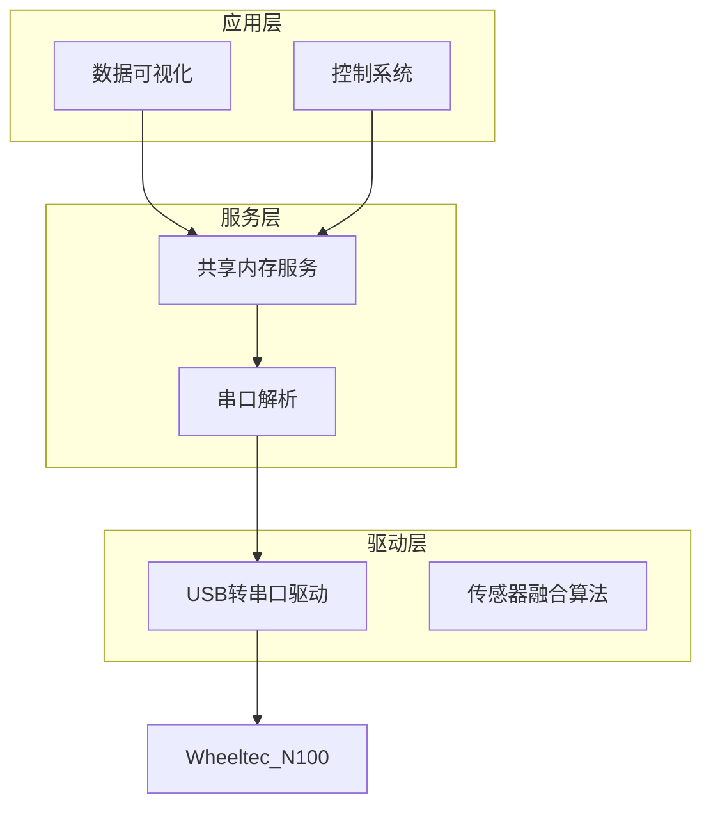
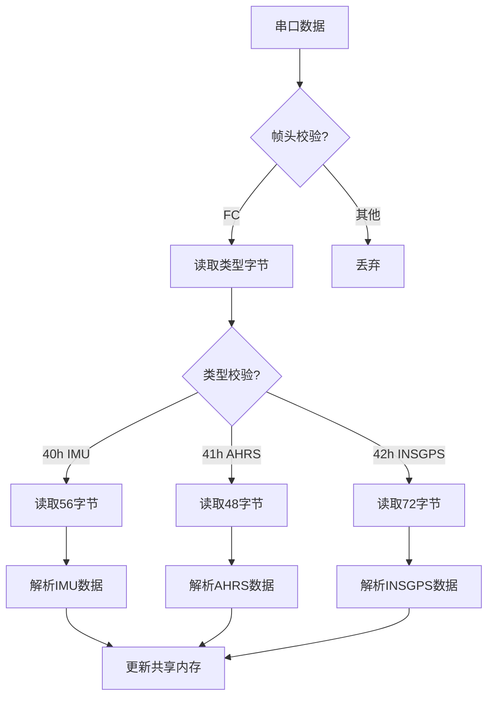
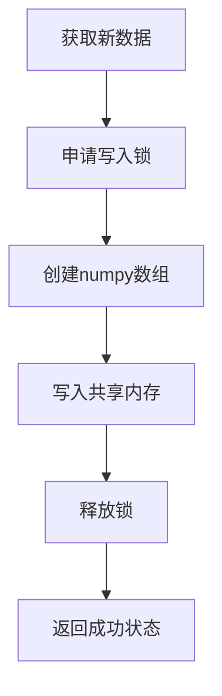
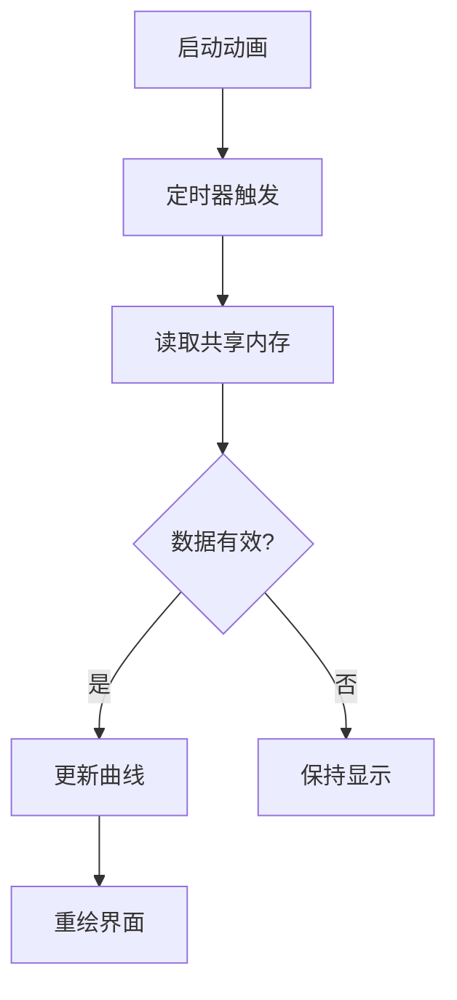

# 2.3 软件系统介绍
## 2.3.1 IMU模块设计说明

### 模块功能
1. 通过串口接收Wheeltec N100传感器的原始数据
2. 解析多种数据帧类型（IMU/AHRS/INSGPS等）
3. 通过共享内存实时传输姿态数据
4. 提供数据可视化接口

### 关键特性
- 支持921600bps高速串口通信
- 6自由度姿态数据输出（Roll/Pitch/Yaw及角速度）
- 自动设备绑定（udev规则）

## 2.3.2 模块分层设计

### 顶层架构


### 核心函数流程图

#### 1. 数据接收流程


关键参数：
```python
输入：
  串口数据流（hex格式）
输出：
  AHRS_DATA.npy:
    [roll, pitch, yaw, roll_speed, pitch_speed, yaw_speed]
```

#### 2. 共享内存更新流程


#### 3. 数据可视化流程


### 关键数据结构

#### 1. 数据帧格式
| 类型 | 长度 | 内容 |
|------|------|------|
| IMU(40h) | 56字节 | 12个float + 2个int32 |
| AHRS(41h) | 48字节 | 10个float + 2个int32 |
| INSGPS(42h) | 72字节 | 16个float + 2个int32 |

#### 2. 共享内存结构
```python
np.array([
    roll,          # 横滚角(rad)
    pitch,         # 俯仰角(rad) 
    yaw,           # 偏航角(rad)
    roll_speed,    # 横滚角速度(rad/s)
    pitch_speed,   # 俯仰角速度(rad/s)
    yaw_speed      # 偏航角速度(rad/s)
], dtype=np.float32)
```

### 错误处理机制
| 错误类型 | 处理方式 |
|----------|----------|
| 串口断开 | 自动重连机制 |
| 数据校验失败 | 丢弃当前帧 |
| 共享内存冲突 | 文件锁保护 |
| 数据超范围 | 自动归一化处理 |