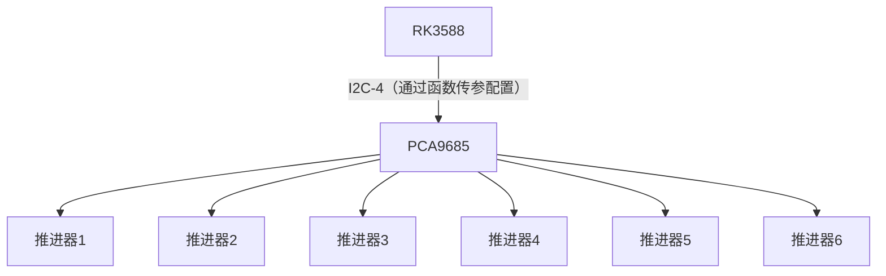
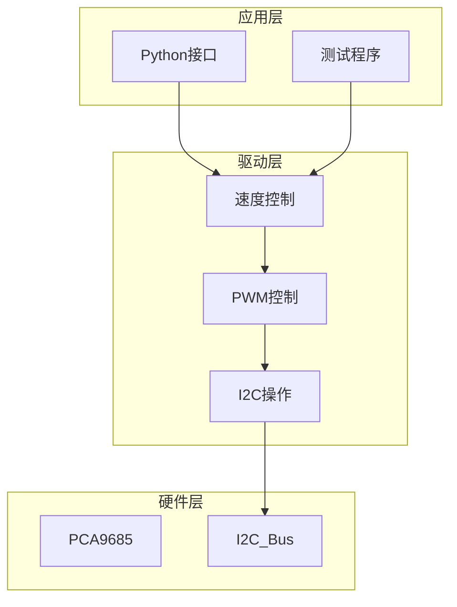
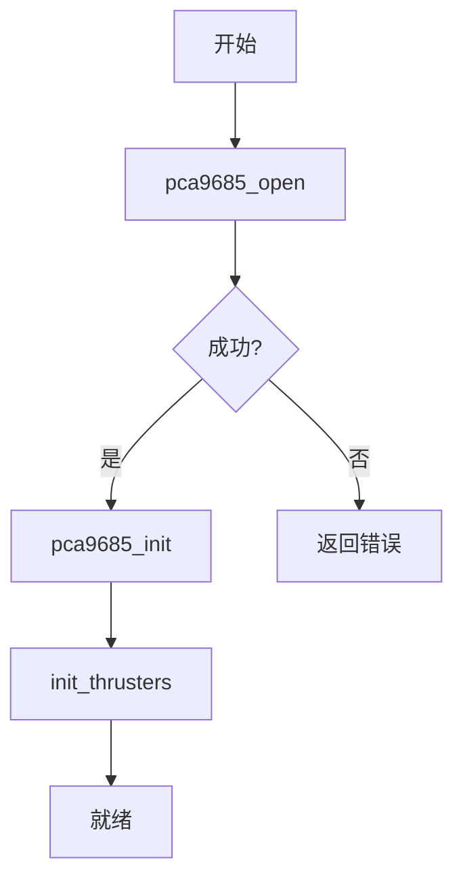
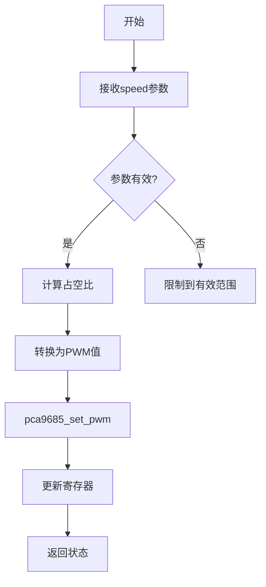
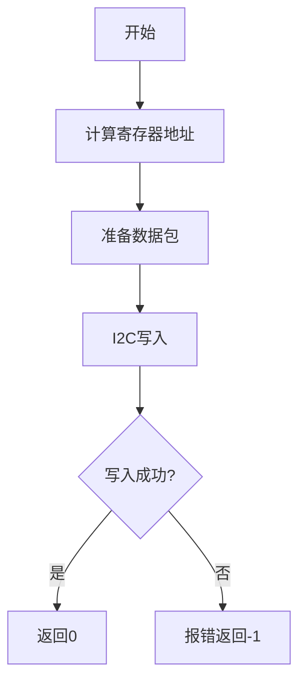

# 2.3 软件系统介绍
## 2.3.1 PCA9685驱动模块设计说明

### 模块功能
1. 通过I2C接口控制PCA9685 PWM芯片
2. 提供6通道推进器速度控制（-100%~100%）
3. 支持PWM频率配置（默认50Hz）
4. 提供Python FFI接口

### 关键特性
- 占空比范围：5%-10%（对应0-100%速度）
- 自动I2C设备管理
- 线程安全操作
- 输入参数校验

### 硬件连接


## 2.3.2 模块分层设计

### 顶层架构


### 核心函数流程图

#### 1. 初始化流程


输入输出：
- 输入：I2C总线路径(`/dev/i2c-4`), 设备地址(0x40)
- 输出：初始化状态(0/-1)

#### 2. 速度控制流程


关键参数：
```python
输入：
  thruster_index: int (1-6)
  speed: float (-100.0~100.0)
输出：
  0: 成功
  -1: 失败
```

#### 3. PWM设置流程


关键寄存器操作：
| 寄存器 | 功能 | 值 |
|--------|------|----|
| MODE1 | 模式控制 | 0xA0 (自动递增) |
| PRESCALE | 频率分频 | 121 (50Hz) |
| LEDx_ON/OFF | PWM控制 | 0-4095 |

### 关键数据结构

#### 1. 寄存器定义
```c
#define PCA9685_MODE1       0x00
#define PCA9685_PRESCALE    0xFE
#define PCA9685_LED0_ON_L   0x06
```

#### 2. 配置参数
```c
#define PWM_FREQUENCY    50    // Hz
#define MIN_DUTY        5.0f  // %
#define MAX_DUTY        10.0f // %
#define THRUSTER_COUNT  6
```

### 错误处理机制
| 错误类型 | 处理方式 |
|----------|----------|
| I2C通信失败 | 关闭设备并返回错误 |
| 无效推进器编号 | 打印错误并返回-1 |
| 超范围速度值 | 自动限制到有效范围 |

### 性能指标
1. PWM分辨率：12位(4096级)
2. 频率精度：±0.5Hz
3. 响应时间：<10ms
4. 最大更新速率：100Hz

### 测试用例
```python
# 正反转测试
for speed in range(0, 101, 10):
    set_thruster_speed(1, speed)  # 正转加速
for speed in range(100, -101, -10):
    set_thruster_speed(1, speed)  # 反转减速

# 多推进器测试
for i in range(1, 7):
    set_thruster_speed(i, 30.0)
```
